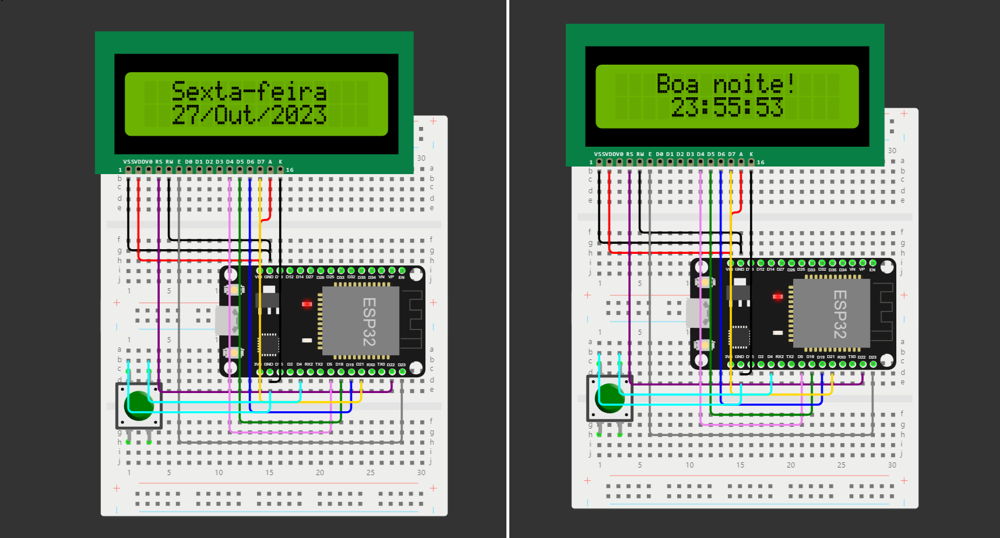

<h1>Projeto Relógio Inteligente com ESP32 e Display LCD</h1>
Este projeto tem como objetivo criar um dispositivo que exibe a hora e a data atuais em um display LCD, além de permitir alternar entre a exibição da data e da hora. O dispositivo também se conecta a um servidor NTP para sincronizar o tempo e ajustar automaticamente.

 **Vídeo de apresentação do projeto:** https://www.youtube.com/watch?v=RoLLQjfQBHQ 

<h2>Componentes Utilizados</h2>
<ul>
   <li>Placa ESP32 (ou compatível)</li>
   <li>Display LCD 16x2</li>
   <li>Push button (Botão de pressão)</li>
   <li>Acesso a uma rede Wi-Fi</li>
   <li>Servidor NTP (a.ntp.br neste exemplo)</li>
</ul>

<h2>Funcionalidades</h2>
<ul>
   <li>Exibe a data e hora atuais em um display LCD 16x2.</li>
   <li>Alternância entre a exibição da data e da hora pressionando um botão.</li>
   <li>Sincroniza o tempo com um servidor NTP para manter a precisão.</li>
   <li>Cumprimento exibido com base na hora atual (Bom Dia, Boa Tarde, Boa Noite).</li>
</ul>

<h2>Bibliotecas Utilizadas</h2>
<ul>
   <li>WiFi: Para a conexão à rede Wi-Fi.</li>
   <li>NTP (Network Time Protocol): Para sincronização do tempo com um servidor NTP.</li>
   <li>LiquidCrystal: Para controlar o display LCD.</li>
</ul>

<h2>Configuração</h2>   
O código faz a configuração inicial da rede Wi-Fi, fuso horário, servidor NTP e inicializa o display LCD. Ele também configura o botão de pressão como entrada com pull-up.

<h2>Funcionamento</h2>
O dispositivo exibe a hora atual e o dia da semana no display LCD. Pressionando o botão, é possível alternar entre a exibição da data e do horário. Além disso, o cumprimento exibido muda com base na hora atual (Bom Dia, Boa Tarde, Boa Noite).

O tempo é sincronizado com um servidor NTP, garantindo a precisão da hora exibida. Quando a sincronização de tempo ocorre, uma notificação é exibida no monitor serial.

<h2>Como Usar</h2>
<ol>1. Conecte a placa ESP32 ao display LCD e ao botão de pressão conforme especificado no código.</ol>
<ol>2. Carregue o código no ESP32 usando a plataforma Arduino IDE.</ol>
<ol>3. Conecte-se a uma rede Wi-Fi configurando o SSID e a senha.</ol>
<ol>4. O dispositivo exibirá a hora e a data atuais. Pressione o botão para alternar entre data e hora.</ol>
<ol>5. O dispositivo sincronizará automaticamente o tempo com o servidor NTP.</ol>
   
<h2>Autor</h2>
Luan Tavares da Silva
